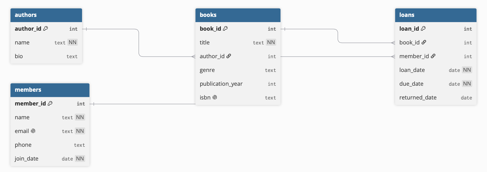

# 📚 Community Library Database

A relational database for managing a community library — tracking books, authors, members, and borrowing activity.

## 📖 Overview

This project implements a normalized PostgreSQL database for a small community library. It tracks:

- **Books** and their **Authors** (one-to-many)
- **Library Members**
- **Loans** (borrowing records) — a many-to-many relationship between books and members

## 🛠️ Technologies

- **PostgreSQL** 15+
- **Git** & **GitHub** for version control
- **dbdiagram.io** for ERD design

## 🗄️ Database Schema



The schema is normalized to **3NF** with the following tables:

| Table | Description |
|-------|-------------|
| `authors` | Author information (name, bio) |
| `books` | Book details (title, genre, publication year) |
| `members` | Library members (name, email, join date) |
| `loans` | Borrowing records (book_id, member_id, loan_date, due_date, returned_date) |

## 🚀 How to Run

### Prerequisites

- PostgreSQL installed (15+ recommended)
- psql command-line tool

### Setup

1. **Create the database:**
   ```bash
   createdb library_db